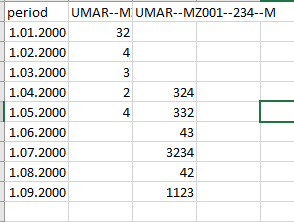

Ta dokument opisuje navodila za pripravo podatkov in metapodatkov za časovne serije, ki jih hočeš uvoziti v našo bazo. 

# Pregled

Namen te funkcionalnosti je, da lahko v bazo vnašaš :

* časovne serije, ki jih pripraviš sam, npr. desezonirane podatke.
* časovne serije iz drugih virov, za katere še nimamo urejenega avtomatskega zajema - to je **začasna** rešitev za podatke, ki jih nujno rabiš, npr. za interaktivne grafe. 

## Postopek

Po tem, ko te Maja Z. doda kot avtorja na bazi (to je treba narediti samo enkrat), dobiš mapo na mreži z imenom `O:\Avtomatizacija\umar-data\<tvoje začetnice>` v kateri bosta dva (Excel) fajla, ki ju moraš "napolniti" s podatki:

* **strukturni fajl** bo opisoval metapodatke za tvoje časovne serije: za vsako serijo ena vrstica; natančna navodila so v poglavju \@ref(meta).
* **podatkovni fajl** bo vseboval same podatke za tvoje časovne serije: za vsako serijo en stolpec; natančna navodila so v poglavju \@ref(data). 

Postopek bo zaenkrat izgledal tako: 

1. "Izpolniti" moraš strukturni fajl - to moraš narediti samo enkrat, da vemo, katere serije pripravljaš. Če hočeš kasneje dodati nove serije, jih enostavno dodaš že obstoječim kot nove vrstice.
2. Podatkovni fajl pa pripraviš oz. posodobiš vsakič, ko imaš nove podatke na voljo. 
2. Ob rednih intervalih se bo izvedla skripta, ki bo preverila, ali so kakšni novi oz. posodobljeni fajli v teh mapah in jih uvozila v bazo.^[Lahko tudi pokličeš Majo Z. in bo sprožila skripto takoj.]
3. Na mail potem dobiš log z outputom te skripte - število vnesenih vrstic oz. javljene napake, če kaj ni bilo v redu pri pripravljenih podatkih. 
4. Ob vsaki posodobitvi podatkov se bo tudi poročilo Indikatorji posodobilo, tako da lahko svoje podatke - če so v kakšnem od tistih grafov - vidiš takoj. 

# Metapodatki {#meta}

V mapi  `O:\Avtomatizacija\umar-data\<tvoje začetnice>` najdeš datoteko z imenom `umar_serije_metadata_<tvoje začetnice>.xlsx`. V to datoteko moraš vnesti metapodatke za vsako serijo, ki jo želiš uvažati v bazo. To moraš narediti samo enkrat. Datoteka je prazna in ima samo imena stolpcev, katerih pomen je razložen v nadaljevanju. 

Če imaš samo nekaj posameznih (nepovezanih) serij, potem ti ni treba preveč razmišljati okoli izpolnjevanja metapodatkov in lahko tretiraš vsako serijo, kot da je svoja *tabela*. 

Če pa imaš več serij, potem moraš pripraviti strukturo na podoben način, kot jo že poznaš iz Si-Stata:

- skupina vsebinsko in metodološko povezanih serij predstavlja eno *tabelo*, 
- vse serije v isti tabeli morajo imeti enak interval (mesečno, četrtletno..)
- vsaka tabela ima najmanj eno *dimenzijo*, lahko jih ima tudi več.
- vsaka dimenzija ima najmanj en *level* oz. stopnjo, lahko jih ima tudi več. 

Recimo primer: Mojca desezonira podatke o prenočitvah iz SURS-a in ima tri serije: prenočitve domačih gostov, tujih gostov in obojih skupaj. Torej gre za **eno tabelo** z **eno dimenzijo**, ki ima **tri stopnje**. Preden se lotiš izpolnjevanja tabele, najprej razčisti, kakšno strukturo imajo tvoji podatki: koliko tabel, katere dimenzije imajo te tabele in katere stopnje. Če ne gre, pokliči Majo Z.!

V nadaljevanju so razložena posamezna polja v tabeli. In ne skrbi: če narobe izpolniš tabelo (vem, da je veliko pravil), dobiš na mail log z razumljivim opozorilom, kaj je bilo narobe :)

## `source`

V to polje napišeš vir(e) podatkov, kjer imaš načeloma dve možnosti:

1. Če gre za podatke, ki si jih pridobil iz zunanjega vira in nekako obdelal (preračunal, desezoniral itd.), potem napišeš najprej `UMAR` in potem originalen vir, npr: `UMAR, SURS`. (Podobno velja, če si pri preračunih uporabil več virov, npr: `UMAR, SURS, EUROSTAT`.)
2. Če pa hočeš samo uvoziti podatke iz nekega vira, ki ga ne zajemamo avtomatično, ampak nisi podatkov nikakor obdelal, potem napišeš obratno: `Investopedia, UMAR`

**Viri morajo biti ena beseda oz. kratica; med seboj jih loči z vejico. In v vsakem primeru mora biti eden od njih "UMAR".**

Zakaj je to važno?

* to polje se bo uporabilo pri avtomatskem določanju kode za tvojo serijo, ki bo izgledala recimo `UMAR–SURS--MZ012-–LJ-–M-–Q` (več v nadaljevanju)
* to polje se bo tudi uporabilo, recimo pri izdelavi grafov, saj bo pod "Vir" avtomatično pisalo "SURS & Preračun UMAR" ali pa samo "Investopedia", odvisno od tega, kaj tukaj napišeš. 

## `author`

V to polje napišeš svoje polno ime. Seveda morajo biti vse vrednosti v tvojem stolpcu enake. Če si kdaj spremeniš ime, bomo zrihtali :)

## `table_name`

Sem vpišeš opisno, ampak ne predolgo ime svoje tabele. Npr: "Mesečne prenočitve, desezonirane" ali kaj podobnega. Lahko tudi dodaš svoje ime, če misliš, da bo komu drugemu hitreje jasno, za kaj gre npr. "Mesečne prenočitve desezonirane (Mojca K.)". 

## `dimensions` 

Sem vpišeš *ime(na) dimenzij* v tej tabeli. 

* Npr. v zgornjem primeru lahko Mojca poimenuje svojo dimenzijo `"Država izvora"`. Ker je samo ena, je to vse kar rabi. *Vsaka tabela mora imeti enake vrednosti v polju `dimensions` za vse serije, ki so v njej*

* *Če imaš več dimenzij, jih loči z dvema pomišljajema: `--`*. Npr. `"Država--Enota"`

Število dimenzij v tem polju se mora skladati z številom stopenj (levels) v naslednjih dveh poljih!

## `dimension_levels_text` in `dimension_levels_code`

Vsaka od zgoraj definiranih dimenzij mora imeti eno ali več stopenj. V teh dveh poljih moraš za te stopnje določiti opis (`text`) in kodo (`code`). 

* Opis naj bo jedrnat, ampak razumljiv.
* Koda naj bo super kratka, najbolje ena črka ali številka, ampak ni slabo, če je malo smiselna. Uporabljaj velike črke in se omeji na maksimalno 4 znake za vsako dimenzijo.

Na primer za zgornji primer bi bilo recimo primerno nekaj takega:

| dimension_levels_text | dimension_levels_code |
|:------- |:-------|
| `Domači`       | `D`       |
| `Tuji`       | `T`       |
| `Skupaj`       | `SK`       |

Če imaš recimo dve dimenziji `"Država--Enota"`, potem bi bilo primerno recimo:

| dimension_levels_text | dimension_levels_code |
|:------- |:-------|
| `Hrvaška--Znesek`       | `HRV--1`     |
| `Hrvaška--Število`       | `HRV--2`         |
| `Avstrija--Znesek`       | `AUT--1`       |
| `Avstrija--Število`       | `AUT--2`       |
| ...      | ...      |

Če ti pri tem delu karkoli ni jasno, pokliči Majo Z. in ti bo pomagala. 

## `unit`

Enota, v kateri so izražene vrednosti serije. Dovoljene so naslednje enote - če tvoje enote ni, javi Maji Z. in jo bo dodala v šifrant:

| unit |
|:------|
|1000   |                      
|mio eur |                     
|%        |                    
|odstotne točke               |
|indeks                       |
|število                      |
|ravnotežje v odstotnih točkah|
|eur                          |
|osebe (1000)                 |
|opravljene delovne ure (1000)|
|1000 toe                     |
|toe/mio eur 2010             |
|mwh/mio eur 2010             |
|toe/preb.                    |
|kwh/preb.                    |
|t/toe                        |
|m2                           |
|m3                           |
|% od bdp                     |

## `interval`

Časovni interval na katerem so merjeni podatki. Trenutno so možne naslednje opcije - javi Maji Z., če rabiš kaj drugega:

* `M` - mesečni podatki
* `Q` - četrtletni podatki
* `A` - letni podatki

## `series_name`

Opisno ime serije. 

Če opisno ime serije  pustiš prazno, se bo zanj uporabljala vrednost iz polja `dimension_levels_text`. Kar je lahko čisto OK, lahko pa napišeš lepše. Z zgornjim primerom, recimo:

| dimension_levels_text |series_name |
|:------- |:-------|
| `Hrvaška--Znesek`       | Povprečni izdatki na turista iz Hrvaške, desezonirano     |
| `Hrvaška--Število`       | Povprečno število prenočitev iz Hrvaške, desezonirano       |
| `Avstrija--Znesek`       | Povprečni izdatki na turista iz Avstrije, desezonirano      |
| `Avstrija--Število`       | Povprečno število prenočitev iz Avstrije, desezonirano      |

## To je to

Evo, vem, da je malo zakomplicirano, ampak to je treba samo enkrat narediti. Zdaj pokliči Majo Z., da zajame te metapodatke v bazo. 

Ko bodo metapodatki uspešno zajeti v bazo, se bosta v tej isti datoteki pojavila izpolnjena še dva nova stolpca, predvsem drugega od njih rabiš za naslednji del:

* `table_code` in 
* `series_code`,

ki sta sestavljena iz vseh teh kod. 

* `table_code` je koda tvojih tabel in bodo izgledale npr: `MK001`, `MK002` itd. 
* `series_code` pa je unikatna koda za vsako serijo in bo izgledala recimo: `UMAR-SURS--MK003--HRV--1--M`

Iz slednje lahko razbereš naslednje:

* gre za podatke, originalno iz SURS-a, ki jih je preračunal nekdo na Umarju.
* ta nekdo ima inicialke MK (in to je njihova tretja tabela)
* ta tabela ima dve dimenziji in ta serija ima zanju vrednosti `HRV` in `1` (kar je lahko bolj ali manj informativno)
* podatki v tej seriji so na mesečni ravni (kar lahko razbereš iz zadnje vrednosti `"M"`)

Takole izgleda primer izpolnjene tabele po zajemu v bazo:

+ zeleni stolpci so obvezni
+ moder stolpec je po želji
+ rdeči stolpci se bodo napolnili po zajemu iz baze. 

## Dodajanje novih serij

V to tabelo lahko vedno dodaš metapodatke za nove serije. Enostavno dodaš nove vrstice, obstoječe pa pustiš pri miru. 

Obstoječi dimenziji lahko dodaš nove stopnje (npr. nove države), obstoječi tabeli pa ne moreš dodati nove dimenzije!

*Potem ko so metapodatki o serijah enkrat vneseni, jih ne moreš več popravljati v tej tabeli. Mislim, lahko probaš, ampak se ne bo nič zgodilo, tako da v takem primeru pokliči Majo Z. in bomo to drugače rešili.*

# Podatki {#data}

Zdaj ko imaš v tabeli z metapodatki izpolnjen zadnji stolpec `series_code`, lahko vneseš podatke v drugo Excel datoteko v svojem folderju. Za to datoteko veljajo naslednja pravila:

* Podatki morajo biti shranjeni na zavihkih z imeni "M", "Q" ali "A" glede na interval (mesečni, četrtletni, letni)
* imena stolpcev morajo biti v prvi vrstici. Na te tri zavihke ne dajaj ničesar drugega kot podatke. Če želiš, lahko narediš drug zavihek za svoje zapiske ali karkoli drugega, dokler so na teh treh zavihkih podatki v spodnji obliki. 
* vsak zavihek, ki vsebuje podatke, mora imeti točno en stolpec z imenom `period`, ki vsebuje obdobja v naslednji obliki:
  - za mesečne podatke: prvi dan v mesecu (npr. 1.01.2023) 
  - za četrtletne podatke: prvi dan v četrtletju (npr. 1.7.2023)
  - za letne podatke štirimestno: recimo 2023 ali 1999
* če tvoje serije pokrivajo različna obdobja, še vedno velja, da smeš imeti samo en stolpec z imenom `period` - enostavno pusti prazna polja za tista obdobja, kjer nimaš podatkov
* vsaka serija - za katero zdaj poznaš `series_code`, ki si ga dobil v Excelu z metapodatki - dobi svoj stolpec. In to je v bistvu to. 

Takole recimo izgleda hipotetična tabela s podatki za dve seriji z mesečnimi podatki. Tabela mora biti na zavihku `M` in imena oz. kode serij morajo obstajati metapodatkih in podatki se bojo brez problema uvozili v bazo. 

## Dodajanje novih podatkov

Ko pripraviš nove podatke, jih enostavno vneseš na ustreznega od teh treh zavihkov ("M", "A" ali "Q") Pri tem velja naslednje:

* podatki za določeno serijo se bodo vnesli v bazo samo, če obstaja nova vrednost za obdobje (`period`), ki še ni bila vnesena v bazo. 
* vnesla se bo cela serija, tudi podatki za prejšnja obdobja, in se shranila kot nov *vintage*.  
* To oboje skupaj pomeni, da lahko popravljaš podatke za prejšnja obdobja, ampak se bodo v bazo zapisali samo, če obstaja tudi vsaj en nov podatek za tisto serijo. 

